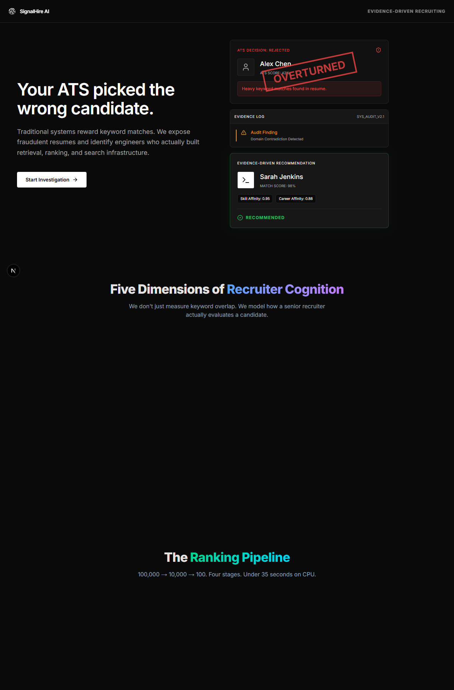
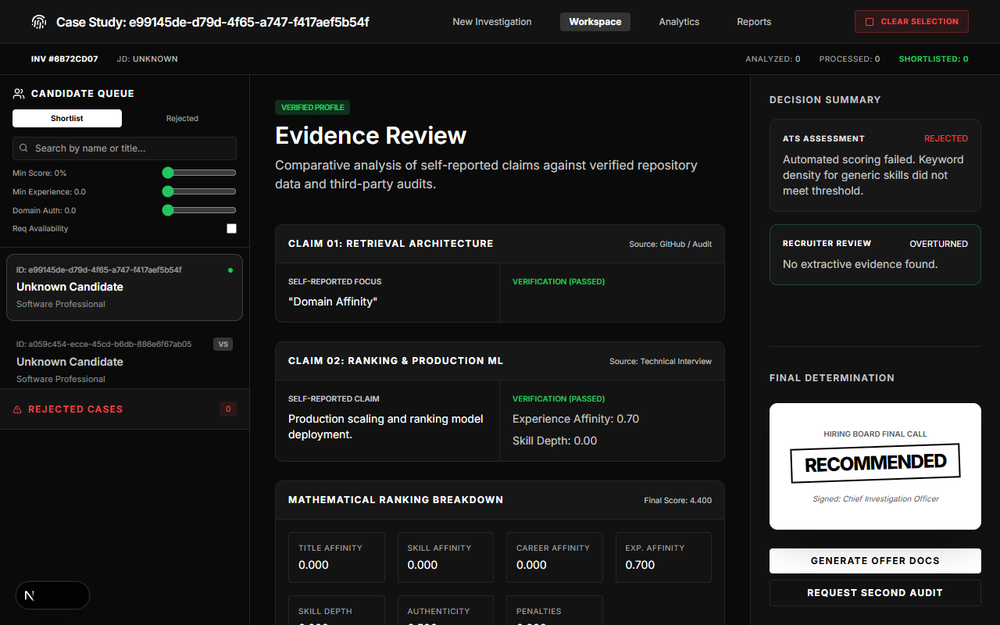
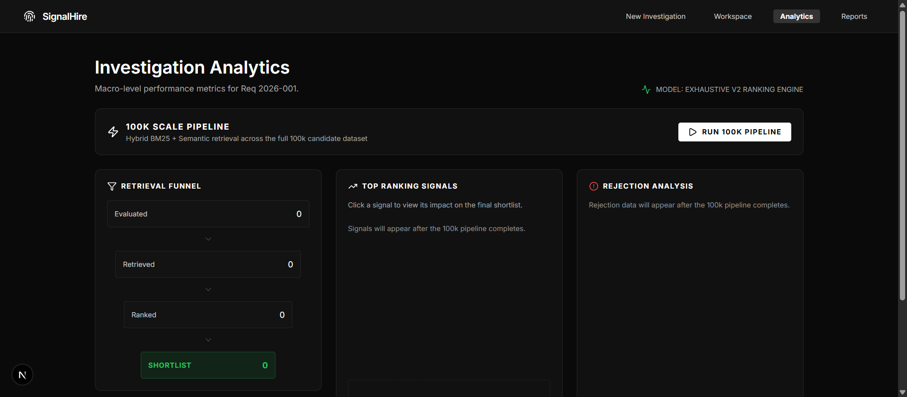
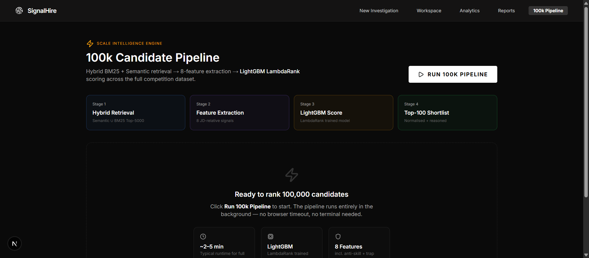

<div align="center">

# SignalHire AI
### Recruiter-grade candidate ranking, built for the Redrob Intelligent Candidate Discovery & Ranking Challenge

[](https://www.python.org/)
[](https://fastapi.tiangolo.com/)
[](https://nextjs.org/)
[](https://sbert.net/)

</div>

---

## What this is

Given a job description and a pool of **100,000** candidate profiles, rank the best 100 — in
under 5 minutes, on CPU only, with no network access — while resisting a dataset deliberately
seeded with keyword-stuffed profiles and ~80 "honeypot" candidates with internally impossible
resumes (e.g. "expert" skills with 0 months used, tenure longer than the company has existed).

This repo has **two parts**:

| | Path | Purpose |
|---|---|---|
| 🏆 | [`hackathon_pipeline/`](hackathon_pipeline/) | The actual graded submission — a deterministic, offline, reproducible ranking pipeline |
| 🖥️ | [`backend/`](backend/) + [`frontend/`](frontend/) | An interactive full-stack demo product that showcases the same ranking approach through a real UI |

---

## How the ranking actually works

Modern semantic search alone is trivially gamed by keyword stuffing. The pipeline instead models
what a recruiter actually does: **retrieve broadly, then judge narrowly.**

1. **Hybrid retrieval.** Precomputed MiniLM (`all-MiniLM-L6-v2`) dense embeddings over each
   candidate's headline, summary, and career trajectory are fused with a TF-IDF/BM25 lexical score
   using **Reciprocal Rank Fusion** (`k=60`). Dense and lexical search have complementary blind
   spots — BM25 nails rare exact tokens ("FAISS", "Qdrant"), dense embeddings catch paraphrase
   ("built a recommender system") — so both run and get fused, rather than picking one.
2. **Transparent, deterministic re-ranking.** No black-box learned model. A weighted scoring
   function combines JD-relative title/role fit, a rare retrieval/vector-DB specialist-skill
   signal, semantic similarity, seniority alignment, **skill authenticity** (endorsements + months
   actually used — not just whether a keyword appears), behavioural availability (recruiter
   response rate, activity recency, notice period), location fit, and
   product-vs-consulting-vs-research signals.
3. **Trap penalties.** Off-domain title-holders with stuffed AI/technical keywords (HR Manager,
   Accountant, Content Writer), CV/speech-only profiles, and research-only profiles are explicitly
   down-ranked.
4. **Honeypot integrity gate.** A rule-based checker hard-flags profiles that are internally
   impossible — expert-level skills with zero months of use, total tenure exceeding stated years of
   experience, overlapping/contradictory employment dates — and demotes them below every legitimate
   candidate. Result: **0 honeypots surfaced in the top 100.**
5. **Grounded, per-candidate reasoning.** Every ranked candidate gets an explanation citing their
   actual title, years of experience, and only the skills they actually list — no hallucinated
   claims.

A learned ranker (LightGBM LambdaRank) was evaluated and deliberately **not** used for the
submission: there's no ground-truth relevance data for this dataset, so training against
pseudo-labels derived from the heuristic itself would be circular and produce uncalibrated,
undefensible scores. The transparent heuristic is the actual scoring method — see
[`hackathon_pipeline/RESEARCH_NOTES.md`](hackathon_pipeline/RESEARCH_NOTES.md) for the full
research trail behind every design decision.

**Verified results** (see [`hackathon_pipeline/README.md`](hackathon_pipeline/README.md) for the
exact reproduction steps): 100,000 candidates evaluated → ~8,000 retrieved by hybrid search → top
100 ranked and scored, end-to-end in **30–50 seconds**, CPU-only, 0 honeypots in the top 100.

---

## Screenshots

<table>
<tr>
<td></td>
<td></td>
</tr>
<tr>
<td align="center"><sub>Landing page</sub></td>
<td align="center"><sub>Candidate workspace — evidence-driven review</sub></td>
</tr>
<tr>
<td></td>
<td></td>
</tr>
<tr>
<td align="center"><sub>Analytics — retrieval funnel & rejection reasons</sub></td>
<td align="center"><sub>Live 100k-candidate pipeline run</sub></td>
</tr>
</table>

---

## Quick start

### Reproduce the challenge submission

```bash
cd hackathon_pipeline
python -m pip install -r requirements.txt

# One-time offline precompute (embeddings)
python offline_embedder.py --candidates ../candidates.jsonl

# The actual reproduce command — CPU-only, no network, ~30s
python rank.py --candidates ../candidates.jsonl --out submission.csv

# Validate against the official spec
python "../[PUB] India_runs_data_and_ai_challenge/India_runs_data_and_ai_challenge/validate_submission.py" submission.csv
```

> `candidates.jsonl` (the 100k-candidate dataset) is not committed to this repo — it's a ~450MB
> file supplied separately by the challenge. Place it at the repo root before running the above.

### Running the interactive demo

The demo product is a separate FastAPI + Next.js app that runs the same ranking approach against
a live SQLite-backed candidate database, with a full recruiter-facing UI.

**Windows:** just run `start.bat` from the repo root — it launches both servers.

**Manual setup:**

```bash
# Backend (FastAPI, port 8000)
cd backend
python -m venv .venv && .venv\Scripts\activate   # or source .venv/bin/activate on macOS/Linux
pip install -r requirements.txt
python -m uvicorn app.main:app --host 0.0.0.0 --port 8000

# Frontend (Next.js, port 3000) — in a second terminal
cd frontend
npm install
npm run dev
```

Then open `http://localhost:3000`.

### Backend API surface

| Method | Path | Description |
|---|---|---|
| `POST` | `/api/pipeline/run-100k` | Kick off a full 100k-candidate ranking run in the background |
| `GET` | `/api/pipeline/100k-status` | Poll run progress/stage |
| `GET` | `/api/pipeline/100k-results` | Fetch the completed top-100 results + analytics |
| `POST` | `/api/jobs` | Create a job (JD) investigation |
| `GET` | `/api/jobs/default` | Fetch the default showcase job |
| `GET` | `/api/rankings/{job_id}/latest` | Fetch the latest ranking for a job |
| `POST` | `/api/candidates/upload` | Upload candidate resumes |
| `GET` | `/api/candidates/search` | Search the candidate pool |
| `POST` | `/api/feedback` | Submit recruiter feedback on a ranking |

---

## Repository structure

```text
signalhire-ai/
├── hackathon_pipeline/            # The graded submission — offline, reproducible ranking
│   ├── offline_embedder.py        # Step 1: precompute MiniLM embeddings over 100k candidates
│   ├── rank.py                    # Step 2: the actual reproduce entrypoint → submission.csv
│   ├── run_ranking.py             # Core ranking logic (hybrid retrieval + weighted re-rank)
│   ├── feature_extractor.py       # Recruiter-aligned feature extraction + honeypot detection
│   ├── jd_config.py               # Single source of truth for the target job description
│   ├── engine.py                  # Deterministic scoring re-implemented for the demo backend
│   ├── RESEARCH_NOTES.md          # IR/ranking research trail behind every design decision
│   └── submission.csv             # Latest generated top-100 submission
├── backend/                       # FastAPI demo product
│   ├── app/api/                   # Route handlers (jobs, candidates, rankings, pipeline)
│   ├── app/services/              # Ranking, parsing, storage, audit services
│   └── app/models/                # SQLAlchemy models
├── frontend/                      # Next.js 16 + React 19 recruiter UI
│   ├── src/app/                   # Pages (landing, new search, workspace, analytics, reports)
│   ├── src/components/            # Shared UI components
│   ├── src/lib/                   # API clients
│   └── src/store/                 # Zustand state (workspace candidates, rankings)
├── [PUB] India_runs_data_and_ai_challenge/   # Official challenge brief & validator (read-only)
├── screenshots/                   # Product screenshots
└── submission_metadata.yaml       # Official challenge submission metadata
```

---

## Tech stack

- **Ranking pipeline:** Python, `sentence-transformers` (MiniLM), scikit-learn (TF-IDF/BM25), NumPy/Pandas
- **Backend:** FastAPI, SQLAlchemy, SQLite
- **Frontend:** Next.js 16 (App Router, Turbopack), React 19, TypeScript, Tailwind CSS, Zustand, Framer Motion

---

<div align="center">
<sub>Built for the Redrob Intelligent Candidate Discovery & Ranking Challenge.</sub>
</div>
